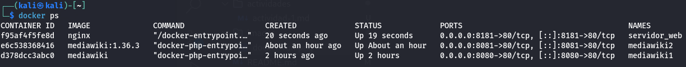

# Actividad 1

Creamos un contenedor a partir de la imagen oficial de `nginx`, establecemos que sea un demonio con `-d` el nombre `servidor_web` con el parámetro `--name` y una redirección de puertos con `-p` al puerto `8181` de la máquina anfitrión.

El comando completo es:
```
docker run -d -p 8181:80 --name servidor_web nginx
```


Verificamos que el contenedor se está ejecutando con `docker ps`.



Si accedemos desde nuestro navegador a la dirección `http://localhost:8181` veremos que el servidor `nginx` está funcionando.


Mostramos las imagenes que tenemos almacenadas en nuestro registro local con `docker images`.


Y para finalizar paramos el contenedor `servidor_web` con el comando `docker stop servidor_web` y lo eliminamos con `docker rm servidor_web`.


Y podemos verificar que no existe el contenedor `servidor_web` con `docker ps -a`.

