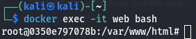
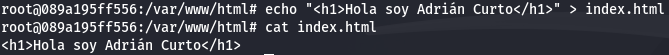
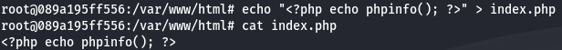
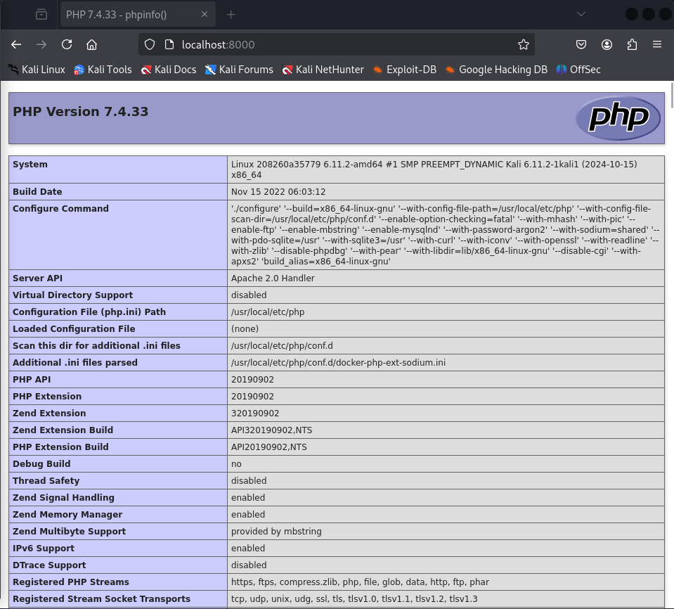
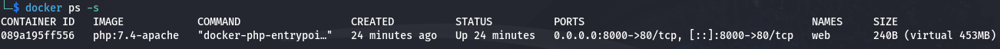
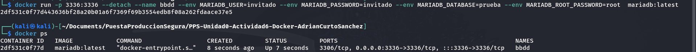
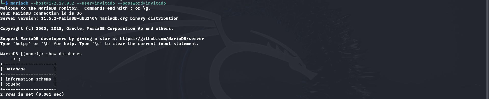
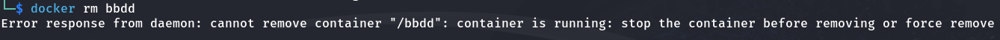

# Actividad 2

## Servidor Web.

Crearemos un contenedor con el nombre `web` empleando la imagen `php:7.4-apache` siendo accesible en el equipo anfitrion por el puerto `8000`, para ello ejecutaremos el siguiente código:
```
docker run -d -p 8000:80 --name web php:7.4-apache
```


Accedemos a la terminal del contendor con el siguiente comando:
```
docker exec -it web bash
```


Estando en la terminal del contenedor creamos el fichero index.html con el siguiente comando:
```
echo "<h1>Hola soy Adrián Curto</h1>" > index.html
```


Al acceder al navegador a en la url http://localhost:8000 veremos el contenido del fichero `index.html`.


Y tambien deberemos crear el fichero index.php con el siguiente comando:
```
echo "<?php echo phpinfo(); ?>" > index.php
```


Al recargar la url http://localhost:8000 veremos que está siviendo el fichero `index.php`.


Con el comando `docker ps -s` podremos conocer el tamaño del contenedor.


---

## Servidor de base de datos.

Cremos un contendor con base de datos MariaDB con el siguiente comando:
```
docker run -p 3336:3336 --detach --name bbdd --env MARIADB_USER=invitado --env MARIADB_PASSWORD=invitado --env MARIADB_DATABASE=prueba --env MARIADB_ROOT_PASSWORD=root  mariadb:latest
```


Empleando un clinete en nuestramáquina anfitrión conectamos a la base de datos empleando el usuario `invitado`.
```
mariadb --host=172.17.0.2 --user=invitado --password=invitado
```

Podemos encontrar la IP del contenedor empleando el comando `docker inspect bbdd`.


Listamos la bases de datos `prueba` creada al inicializar el contendor.
```
show databases
```



Y observamos que no podemos borrar el contendor `bbdd` mientras este esté en ejecución.
```
docker rm bbdd
```
