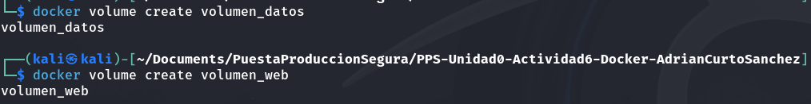
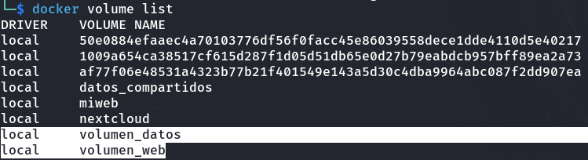
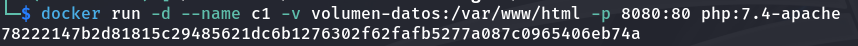
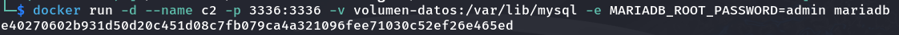
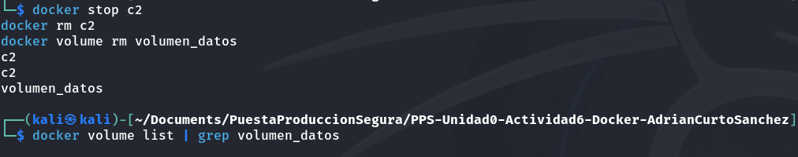
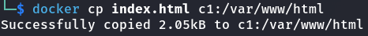
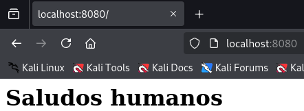
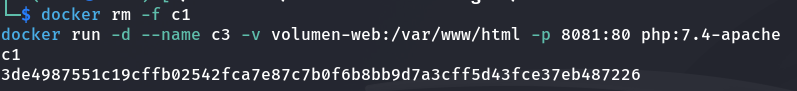
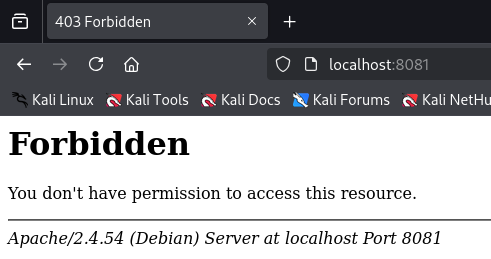

# Actividad 3

## Creación y uso de volúmenes
Creación de los volúmenes `volumen_datos` y `volumen_web`.
```
docker volume create volumen_datos
docker volume create volumen_web
```


Y listamos los volúmenes creados con `docker volume list`.



Creación del container `c1`:
```
docker run -d --name c1 -v volumen-web:/var/www/html -p 8080:80 php:7.4-apache
```


Creación del container `c2`:
```
docker run -d --name c2 -p 3336:3336 -v volumen-datos:/var/lib/mysql -e MARIADB_ROOT_PASSWORD=admin mariadb
```


Para borrar el volumen `volumen_datos`, deberemos detener el contendor que lo está empleando así como borrar dicho contenedor.
```
docker stop c2
docker rm c2
docker volume rm volumen_datos
```


Copiamos el fichero `index.html` en el contenedor `c1` y comprobamos que el servicio lo está sirviendo correctamente.
```
docker cp index.html c1:/var/www/html
```



Borrado del contendor `c1` y creación del contenedor `c3`.
```
docker rm -f c1
docker run -d --name c3 -v volumen-web:/var/www/html -p 8081:80 php:7.4-apache
```


Al visualizar lo que devuelve el servicio a traves del navegdor nos encontramos con que mantiene el fichero `index.html`.


