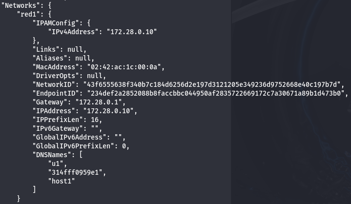
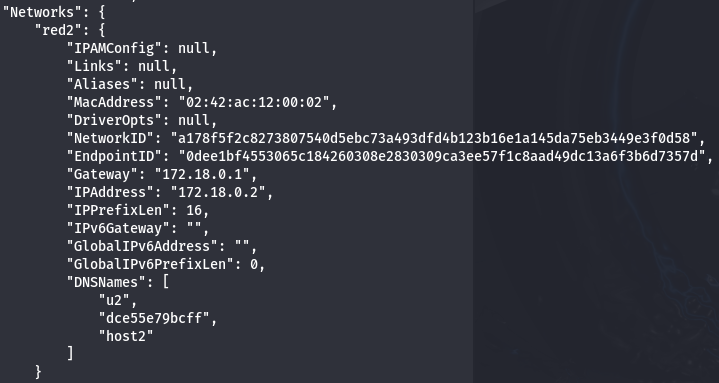
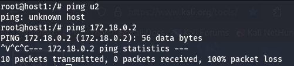
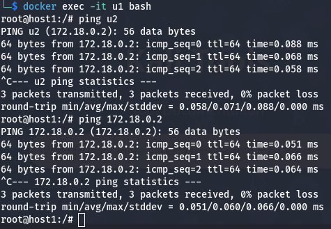

# Actividad 4

## Trabajar con redes docker 

Ceación de la `red1`.
```
docker network create red1 --subnet 172.28.0.0/16 --gateway 172.28.0.1
```

Ceación de la `red2`.
```
docker network create red2
```

Poner en ejecución el contenedor `u1`.
```
docker run -d -it --name u1 --network red1 --ip 172.28.0.10 --hostname host1 ubuntu:20.04
```

Poner en ejecución el contenedor `u2`.
```
docker run -d -it --name u2 --network red2 --hostname host2 ubuntu:20.04
```

Con el comando `docker inspect u1` podemos inspeccionar la configuración de red del contenedor `u1`:


Con el comando `docker inspect u2` podemos inspeccionar la configuración de red del contenedor `u2`:


Accedemos al contenedor `u1` con `docker exec -it u1 bash` y ejecutamos `apt update && apt install inetutils-ping -y` para poder realizar ping al contenedor `u2` con `ping u2` y `ping 172.18.0.2`:



Conectar el contenedor `u1` a la red `red2` con el comando `docker network connect red2 u1`, tras ello podrá hacer ping al contenedor `u2`:


