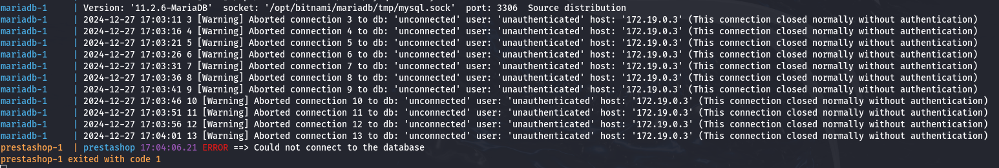
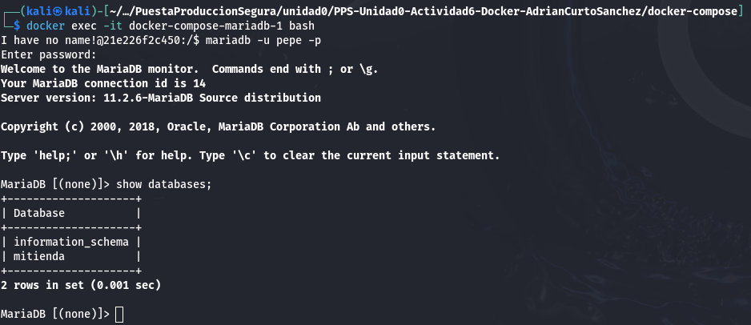

# Actividad 5

## Trabajar con redes docker 

Creación del fichero `compose.yaml` con `nano compose.yaml`:
```yaml
# Copyright VMware, Inc.
# SPDX-License-Identifier: APACHE-2.0

version: '2'
services:
  mariadb:
    image: docker.io/bitnami/mariadb:11.2
    environment:
      # ALLOW_EMPTY_PASSWORD is recommended only for development.
      - ALLOW_EMPTY_PASSWORD=yes
      - MARIADB_USER=pepe
      - MARIADB_PASSWORD=pepe
      - MARIADB_DATABASE=mitienda
    volumes:
      - './db-data:/bitnami/mariadb'
  prestashop:
    image: docker.io/bitnami/prestashop:8
    ports:
      - '80:8080'
      - '443:8443'
    environment:
      - PRESTASHOP_HOST=192.168.1.88
      - ALLOW_EMPTY_PASSWORD=yes
      - PRESTASHOP_DATABASE_HOST=mariadb
      - PRESTASHOP_DATABASE_PORT_NUMBER=3306
      - PRESTASHOP_DATABASE_USER=pepe
      - PRESTASHOP_DATABASE_PASSWORD=pepe
      - PRESTASHOP_DATABASE_NAME=mitienda
    volumes:
      - './prestashop-data:/bitnami/prestashop'
    depends_on:
      - mariadb
```

Al usar volúmenes de tipo bind, tendremos que crear los directorios `db-data` y `prestashop-data` con los siguientes comandos:
```
mkdir db-data
mkdir prestashop-data
```

Ejecutamos los servicios definidos en `compose.yaml` con `docker compose up -d` y listamos los contenedores que están corriendo con `docker-compose ps`:


Al parecer con esta versión ofrecida por Bitnami no funciona correctamente la conexión a la base de datos pese a terner bien definidas las variables de entorno:


Si ejecutamos una terminal en el contenedor de MariaDB vemos que podemos acceder sin problemas:


Si todo funcionase correctamente desde el navegador web podríamos acceder al servicio de prestashop en la url http://localhost:8080 .
