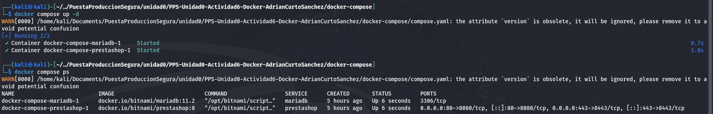

# Actividad 5

## Trabajar con redes docker 

Creación del fichero `docker-compose.yml` con `nano docker-compose.yml`:
```yml
# Copyright VMware, Inc.
# SPDX-License-Identifier: APACHE-2.0

version: '2'
services:
  mariadb:
    image: docker.io/bitnami/mariadb:11.2
    environment:
      # ALLOW_EMPTY_PASSWORD is recommended only for development.
      - ALLOW_EMPTY_PASSWORD=yes
      - MARIADB_USER=pepe
      - MARIADB_PASSWORD=pepe
      - MARIADB_DATABASE=mitienda
    volumes:
      - './db-data:/bitnami/mariadb'
  prestashop:
    image: docker.io/bitnami/prestashop:8
    ports:
      - '80:8080'
      - '443:8443'
    environment:
      - PRESTASHOP_HOST=10.0.2.25
      - PRESTASHOP_DATABASE_HOST=mariadb
      - PRESTASHOP_DATABASE_PORT_NUMBER=3306
      - PRESTASHOP_DATABASE_USER=pepe
      - PRESTASHOP_DATABASE_PASSWORD=pepe
      - PRESTASHOP_DATABASE_NAME=mitienda
      # ALLOW_EMPTY_PASSWORD is recommended only for development.
      - ALLOW_EMPTY_PASSWORD=yes
    volumes:
      - './prestashop-data:/bitnami/prestashop'
    depends_on:
      - mariadb
```

Ejecutamos los servicios definidos en `docker-compose.yml` con `docker-compose up -d` y listamos los contenedores que están corriendo con `docker-compose ps`:
