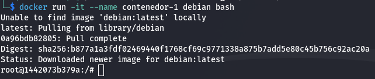
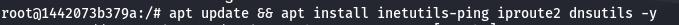
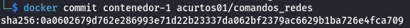
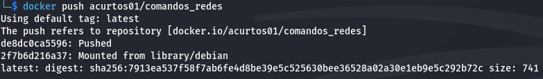
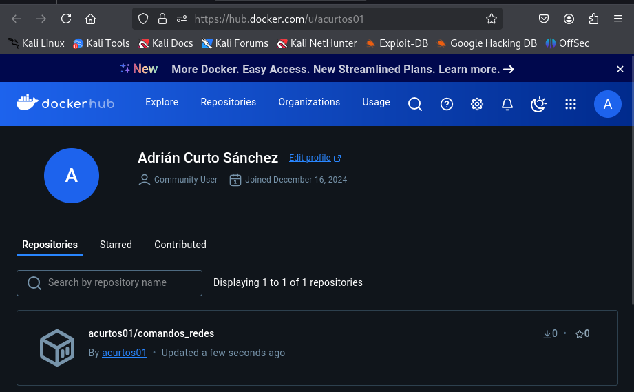
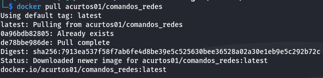
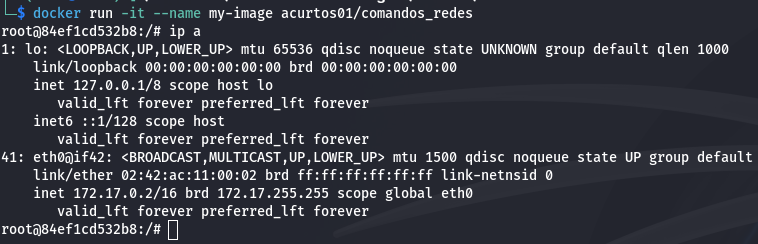

# Actividad 6

## Creación de una imagen a partir de un contenedor 

1. Ejecutamos un container de Debian con `docker run -it --name contenedor-1 debian bash`.

2. Una vez dentro del contenedor ejecutamos `apt update && apt install inetutils-ping iproute2 dnsutils -y` para intalar paquetes.

 
3. Creamos una nueva imagen a partir de `contenedor-1` ejecutando `docker commit contenedor-1 acurtos01/comandos_redes`.

4. Subimos la imagen a Docker Hub con el comando `docker push acurtos01/comandos_redes`

5. Descargamos la imagen en otro equipo con el comando `docker pull acurtos01/comandos_redes` y ejecutarla con `docker run -it --name my-image acurtos01/comandos_redes`.

